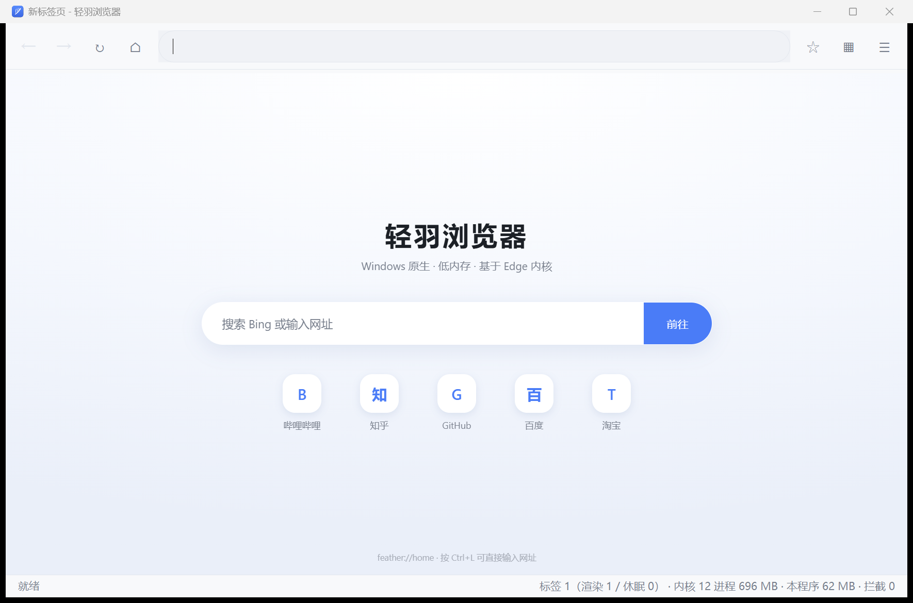
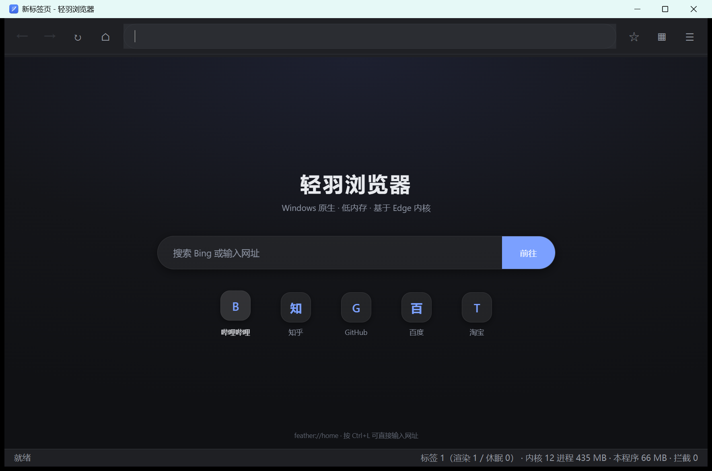

# 轻羽浏览器 · Feather Browser

Windows 上的轻量浏览器，界面形态参考安卓端 **Via 浏览器**：没有起始页广告、没有账号体系、
没有一堆用不上的按钮，只有地址栏、几个图标和一个标签列表。核心目标是**内存占用低**。

- **内核**：系统自带的 Microsoft Edge WebView2 运行时（不随程序打包 Chromium）
- **外壳**：.NET 8 WinForms，程序自身托管代码约 170 KB
- **安装包**：46 MB（自包含 .NET 运行时，用户无需预装任何环境）
- **平台**：Windows 10 / 11，64 位

| 浅色 | 深色 |
|---|---|
|  |  |

---

## 一、下载与安装

到 [Releases](https://github.com/iownmmiku/feather-browser/releases) 下载
`FeatherBrowser-x.y.z-setup.exe`，双击安装即可。

安装程序会：

1. 释放程序文件到 `%ProgramFiles%\Feather Browser`；
2. 创建开始菜单与桌面快捷方式；
3. **检测 WebView2 运行时**——缺失时会询问是否从微软官方地址下载安装
   （约 2 MB，需联网）。这个运行时是显示网页所必需的，按微软许可不能随本程序分发，
   所以只做检测与引导；
4. 注册卸载信息，可在「设置 → 应用 → 已安装的应用」中卸载。
   卸载时会询问是否一并删除书签、历史等个人数据。

> 无需预装 .NET：安装包已内置 .NET 8 运行时。

## 二、从源码构建

```powershell
# 1) 只编译（需要 .NET 8 SDK，输出体积小，依赖机器上已装的 .NET）
dotnet build .\src\FeatherBrowser.csproj -c Release

# 2) 生成自包含发布 + 安装程序（需要 NSIS 3，默认装在 C:\Program Files (x86)\NSIS）
.\tools\build-installer.ps1 -Version 1.0.0
```

`build-installer.ps1` 会先做自包含发布（`win-x64`），再调用 NSIS 打包，
产物落在 `dist\` 目录。

## 三、内存占用怎么压下来的

这是整个项目的重点，按重要性排列。

### 1. 同时只让固定数量的标签「活着」，其余直接休眠

每个标签都是一个独立对象（[`BrowserTab`](src/Core/BrowserTab.cs)），存活状态分两档
（外加一个过渡态）：

| 档位 | WebView2 状态 | 内存 | 切回去的代价 |
|---|---|---|---|
| **渲染中** Live | 内核就绪、正在渲染 | 最高 | 瞬时 |
| **已休眠** Cold | WebView2 已 `Dispose` → 渲染进程退出 | 只剩 URL 字符串 | 重新加载页面 |
| 已挂起 Suspended | 调 `TrySuspendAsync()`，页面状态保留 | 略低于渲染中 | 瞬时恢复 |

调度逻辑是 [`TabManager.EnforceMemoryPolicy()`](src/Core/TabManager.cs) 里的**填桶算法**：
当前标签先占一个名额，剩下的按「最近使用时间」从新到旧填，填满上限就停，
**所有没填进去并且还持有 WebView2 的标签全部休眠**。

结果是**内存取决于同时渲染的标签数，与标签总数无关**——开 20 个标签和开 2 个标签是同一量级。

这一档设计踩过一个坑，值得记下来：最初中间档用 `TrySuspendAsync` 做主要手段，
但实测它要求视图处于**不可见**状态才会成功，用在「标签数超限」这种场景失败率很高，
一次失败就意味着上限形同虚设（自检里表现为「上限 2，实际 3 个标签在渲染」）。
所以现在中间档只用于「窗口失去焦点」这种视图确实不可见的情况，
超限的标签直接休眠，结果是确定的。

标签列表里用颜色点标出每个标签的档位（绿=渲染中 / 黄=已挂起 / 灰=已休眠），
不开任务管理器也能看见回收是否发生。

### 2. 窗口失焦就挂起后台标签

切到别的程序时，看不见的网页继续渲染毫无意义。
[`MainForm.OnDeactivated`](src/UI/MainForm.cs) 会调用 `SuspendBackgroundTabs()`，
把这些不可见的后台标签挂起；窗口重新激活时恢复。这类调用里 `TrySuspendAsync` 是可靠的，
因为视图本来就不在屏幕上。

### 3. 可手动触发回收

菜单里的「立即回收标签内存」调用 `TabManager.ReclaimNow()`：把所有非当前标签的
WebView2 直接销毁，并调用 `MemoryMonitor.TrimWorkingSet()`
（紧凑 GC + `EmptyWorkingSet`）把已经空出来的工作集立刻还给系统，
让任务管理器里的数字和真实占用一致，而不是虚高。

### 4. 大量使用自绘控件

工具栏按钮是自绘的 [`ToolbarButton`](src/UI/ToolbarButton.cs)（一个 `Control` 只画一个字形），
标签列表是 `OwnerDrawFixed` 的单个 `ListBox`（不是每个标签一个控件），
状态栏是自绘 `Control`（不是 `StatusStrip` + 若干 `ToolStripStatusLabel`）。
菜单同理，用无边框窗体 + 一个 `ListBox`，而不是 `ContextMenuStrip`。
这一层省下的内存不大（几 MB），但省下的是**每个控件都带的对象图与 GDI 句柄**，
而且渲染更干净、没有系统主题边框。

### 5. 内置首页是本地 HTML

新标签页由 [`UrlUtils.BuildHomeHtml()`](src/Core/UrlUtils.cs) 生成一段自包含 HTML，
通过 `NavigateToString` 直接塞给内核，不发任何网络请求，也不需要额外的 WebView。
深色主题下会换成深色一套配色。

### 6. 不打包 Chromium

程序只引用 `Microsoft.Web.WebView2`，运行时复用系统已安装的 Edge WebView2 运行时。
**内核文件在系统里只存一份**，装多少基于 WebView2 的程序都共享。

### 7. 图片开关用 CSS 而不是拦截请求

关闭「加载图片」时，程序在 `DOMContentLoaded` 后注入一条 CSS 规则隐藏图片元素。
图片仍然会被下载，但不再解码、不再占位图内存——对「内存优先」的场景比拦截请求更省内存。

## 四、界面

### 圆角风格

整个界面只用**一个**圆角来源：[`Theme.Radius`](src/UI/Theme.cs)。
地址栏是胶囊形（半径取高度一半），图标按钮、菜单项、标签卡片、进度条都用
`Theme.Radius` / `Theme.RadiusSmall`，因此各处弧度天然一致，
不会出现「按钮是直角、输入框是圆角」这种割裂。

弹层（菜单、标签列表）用 `Region` 把窗口本身裁成圆角矩形，
悬停与选中用整块圆角卡片底色，而不是直角高亮条。

### 主题：浅色 / 深色 / 跟随系统

设置里或菜单里切换（快捷键 `Ctrl+J` 循环），三种模式：

| 模式 | 行为 |
|---|---|
| **跟随系统**（默认） | 读 Windows 的「应用模式」设置，并用 `SystemEvents.UserPreferenceChanged` 实时跟随 |
| 浅色 | 固定浅色 |
| 深色 | 固定深色 |

深色模式做了这些事，缺一个都会「半黑半白」：

- **窗口外壳**：工具栏、地址栏、网页区全套深色
- **标题栏**：调 `DwmSetWindowAttribute(DWMWA_USE_IMMERSIVE_DARK_MODE)`，
  否则深色界面顶上会顶一条白色标题栏
- **网页区域**：给 WebView2 设 `DefaultBackgroundColor` 避免加载时闪白，
  并让内核按深色渲染网页（`Profile.PreferredColorScheme` +
  环境参数 `--enable-features=WebContentsForceDark`）
- **内置首页**：它是我自己生成的 HTML，深色下换成深色一套渐变、文字与卡片色
- **原生输入控件**：WinForms 的 `TextBox` / `ComboBox` / `NumericUpDown`
  在深色下会顽固地留白底，所以写了三个替换件
  （[`ThemedInputs.cs`](src/UI/ThemedInputs.cs)），自己绘制圆角底、描边与下拉项

配色切换靠 [`Theme.ApplyTo(form)`](src/UI/Theme.cs) 一个入口递归套用到所有子控件，
新增控件不需要在别处补一遍颜色。

### 界面放大

所有尺寸走 `Theme.Sx/Sy`（DPI 感知），字号走 `Theme.Pt`。
在此基础上还有一档**用户可调的界面倍率**：100% / 115%（默认）/ 130% / 150%，
菜单「界面放大」或设置里都能改，`Ctrl+=` 循环、`Ctrl+0` 复位。

## 五、功能

**浏览**
- 地址栏智能识别：输入 `github.com` 直接访问，输入「天气」送去搜索
- 后退 / 前进 / 刷新 / 停止 / 首页
- 多标签：新建、关闭、切换、关闭全部、恢复上次会话（最多 20 个）
- 无痕窗口：独立临时数据目录，关闭时整体删除
- 页内查找（注入脚本实现，用 `window.find`）
- 缩放 25%～500%；F11 全屏
- 网页里的非 http(s) 链接（`tel:`、`mailto:`、`magnet:` 等）交给系统处理
- `window.open` / `target=_blank` 在当前窗口新开标签，而不是弹出新窗口
- 下载走系统下载管理器（自带进度通知）

**隐私与拦截**
- 域名级广告/追踪拦截，内置约 200 条规则（[`Assets/blocklist.txt`](src/Assets/blocklist.txt)）
- 支持用户自定义规则：`%LOCALAPPDATA%\FeatherBrowser\user_blocklist.txt`，
  一行一个域名，`!` 开头表示白名单，也兼容 hosts 格式与 `||example.com^` 写法
- 拦截计数显示在状态栏

**数据**
- 书签（`Ctrl+D` / 地址栏右侧星标）
- 历史记录（内存里只保留最近 800 条，因此长期使用内存也是常数级）
- 全部数据集中在 `%LOCALAPPDATA%\FeatherBrowser\`，卸载只需删这一个目录

## 六、快捷键

| 快捷键 | 功能 | 快捷键 | 功能 |
|---|---|---|---|
| `Ctrl+T` | 新建标签 | `Ctrl+W` | 关闭当前标签 |
| `Ctrl+Shift+T` | 标签列表 | `Ctrl+Shift+N` | 无痕窗口 |
| `Ctrl+Tab` | 下一个标签 | `Ctrl+PageUp/Down` | 上/下一个标签 |
| `Ctrl+L` | 聚焦地址栏 | `Ctrl+D` | 收藏当前页 |
| `Ctrl+F` | 页内查找 | `F5` / `Ctrl+R` | 刷新 |
| `Alt+←/→` | 后退 / 前进 | `Ctrl++` `Ctrl+-` | 网页缩放 |
| `Ctrl+J` | 切换主题 | `Ctrl+=` / `Ctrl+0` | 界面放大 / 复位 |
| `F11` | 全屏 | `Esc` | 停止加载 / 关闭查找条 |

## 七、实测数据

自检报告见 [`docs/selftest-report.txt`](docs/selftest-report.txt)。
它连续打开 5 个真实网站（example.com / Bing / 百度 / cn.bing / 搜狗），
每打开一个就采样一次内存，报告里还带有内存策略的逐步决策轨迹。

```powershell
.\src\bin\Release\net8.0-windows\FeatherBrowser.exe --selftest report.txt
```

结论（以本机实测报告为准）：

- **同时处于「渲染中」的标签始终不超过设定的上限（默认 2 个）**，第 3 个及以后的标签全部休眠；
- 内核工作集：只有 1 个标签时约 483 MB，开着 5 个标签时约 601 MB，**增量约 +117 MB**；
- 系统可用内存：1 个标签时约 4319 MB，5 个标签时约 4236 MB，减少约 83 MB；
- 程序自身（`FeatherBrowser.dll`）约 170 KB，不打包 Chromium。

需要注意：

- 系统里 `msedgewebview2.exe` 的绝对进程数会包含 Edge 自身已经常驻的后台进程
  （本机空闲时就有 6 个），所以判断内存高低应当看**打开更多标签带来的增量**，
  而不是孤立看总进程数；
- 工作集统计包含多个进程共享的页面，所以增量会小于各进程工作集之和；
- 系统可用内存会受其它程序影响而上下浮动，只能作参考。

## 八、目录结构

```
feather-browser/
├─ src/
│  ├─ Program.cs                 入口（含 --selftest / --theme / --uitest 分支）
│  ├─ SelfTest.cs                命令行内存自检
│  ├─ app.manifest               高 DPI 感知声明
│  ├─ Assets/blocklist.txt       内置拦截规则（编译进程序集）
│  ├─ Core/
│  │  ├─ BrowserTab.cs           标签：存活档位、导航、查找、内核事件绑定
│  │  ├─ TabManager.cs           ★ 内存策略调度中心（填桶算法）
│  │  ├─ AdBlocker.cs            域名 + 路径关键字拦截
│  │  ├─ MemoryMonitor.cs        进程内存统计与工作集回收
│  │  ├─ HistoryStore.cs         历史（内存上限 800 条）
│  │  ├─ BookmarkStore.cs        书签
│  │  └─ UrlUtils.cs             地址识别、内置首页 HTML（浅色/深色两套）
│  ├─ Services/
│  │  ├─ AppSettings.cs          设置与会话（含主题模式、界面倍率）
│  │  ├─ AppPaths.cs             数据目录与日志
│  │  └─ JsonContext.cs          System.Text.Json 源生成上下文
│  └─ UI/
│     ├─ MainForm.cs             ★ 主窗口
│     ├─ Theme.cs                ★ 配色 / 字体 / 尺寸 / 圆角 / 主题切换
│     ├─ ToolbarButton.cs        自绘圆角图标按钮（带数字徽标）
│     ├─ ThemedInputs.cs         深色可用的输入框 / 下拉框 / 数字框
│     ├─ WindowChrome.cs         请求 Windows 深色标题栏
│     ├─ TabListPopup.cs         标签列表（圆角卡片 + 档位色点）
│     ├─ PopupMenu.cs            下拉菜单（圆角面板）
│     ├─ StatusBar.cs            自绘状态栏
│     ├─ MemoryDialog.cs         内存与性能面板
│     ├─ SettingsDialog.cs       设置
│     └─ AppIcon.cs              代码生成的程序图标
├─ tools/
│  ├─ build-installer.ps1        自包含发布 + NSIS 打包
│  ├─ installer.nsi              NSIS 安装脚本
│  ├─ screenshot.ps1             自动截图（含同进程弹层），用于核对排版
│  └─ WinShot.cs                 截图用的 Win32 辅助类
├─ docs/                         截图与自检报告
├─ LICENSE                       MIT
└─ README.md
```

## 九、开发提示

几个调试开关（普通用户用不到）：

```powershell
# 临时切换主题，不改配置文件
FeatherBrowser.exe --theme=dark

# 启动后自动打开某个界面，配合 tools\screenshot.ps1 自动出图核对排版
# 取值：tabs | menu | settings | memory | find | switch
FeatherBrowser.exe --uitest=settings
$env:FEATHER_UITEST_DELAY='2000'   # 控制弹层延时（毫秒）

# 内存自检
FeatherBrowser.exe --selftest report.txt
```

## 十、已知限制

- 页内查找是注入脚本实现的高亮跳转，没有「第 3/17 项」这样的计数。
- 「加载图片」关闭后需要刷新页面才生效。
- 广告拦截是域名级 + 路径关键字级，不做 ABP 的完整规则语法（例如复杂的 `$domain=` 修饰）。
  这是有意的取舍：完整规则引擎编译后动辄几十 MB 内存，与项目目标冲突。
- 无痕窗口使用独立临时目录实现，不读取系统 Edge 的登录状态。
- 没有扩展、没有同步、没有书签导入导出。
- 深色模式下网页能否变暗取决于内核的自动深色渲染，部分网站不会生效。

## 十一、和 Via 的关系

界面形态与交互习惯参考了 Via 的极简思路：单窗口、顶部一条细工具栏、底部一条功能条、
标签以列表卡片方式管理、菜单里集中收纳开关。代码是独立实现的，
没有使用 Via 的任何代码或资源（Via 是安卓应用，技术栈完全不同）。

省内存的思路也是同源的：**不追求「同时把所有标签都渲染好」，而是承认后台标签不需要活着**，
把「活着」的标签数量压到最低，用一点点切换时的加载时间换回内存。

## 十二、许可

[MIT](LICENSE)。使用的 Microsoft Edge WebView2 运行时由微软提供，
遵循其自身许可条款，不随本项目分发。
